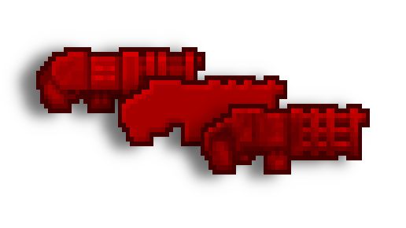
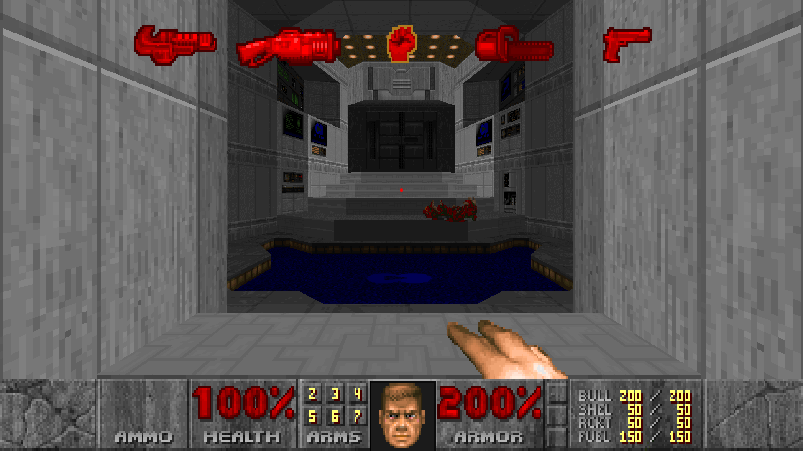
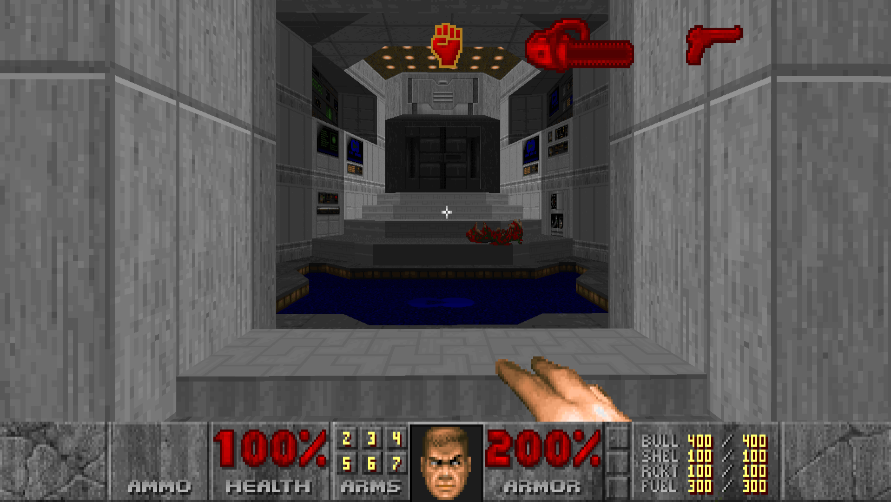
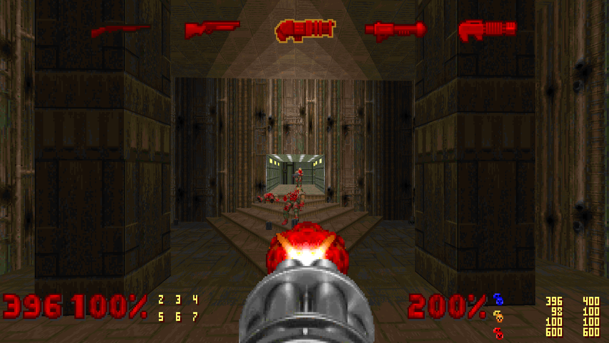
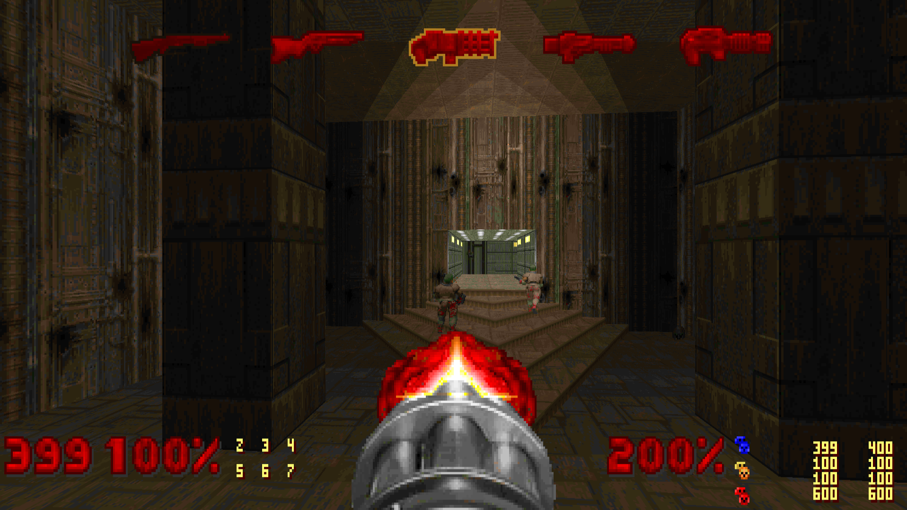
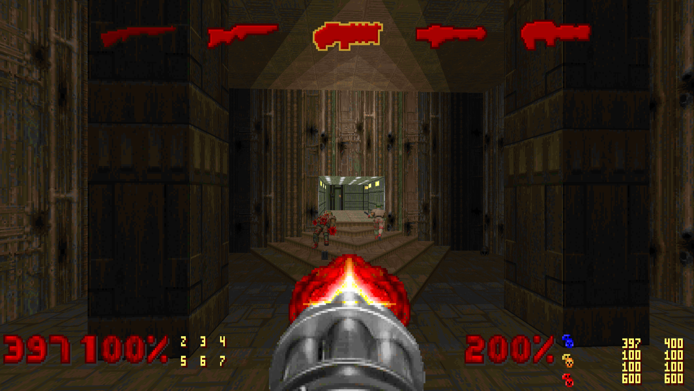

# Doom Carousel Icons

 

  

 

Originally introduced in the [Unity](https://doomwiki.org/wiki/Doom_Classic_Unity_port) port of Doom, later included in the [KEX](https://doomwiki.org/wiki/Doom_%2B_Doom_II) port, this featured highlights to the player what weapons are currently available.

Check the official Doomworld Forums [thread](https://www.doomworld.com/vb/thread/150923) for this project.

### Feature support

| Name      | Description |
|-----------|-------------|
| Native    | Is the Weapon Carousel natively supported on this port? |
| Animated  | Does the Weapon Carousel animated smoothly when switching weapons? |
| Looping   | Does the Weapon Carousel visually loop between the final and initial weapon slots?2 |
| DeHackEd  | Is the entry `Carousel Icon = "<lumpname>"` supported on the `Weapon` DeHackEd definitions?1 |

Note 1: While this DeHackEd option can define custom icons in any compatibility level, it is mainly useful in ID24-compatible ports, where additional custom weapon definitions are possible.  
Note 2: See the following screenshots for the looping visual.

  
Looing on KEX

  

    
  

  
Non-Looing on KEX

  

    
  

| Port          | Native                | Animated           | Looping     | DeHackEd           | Download |
|---------------|:---------------------:|:------------------:|:------------------:|:------------------:|----------|
| Unity         | :heavy_check_mark:    | :x:                | :heavy_check_mark: | :x:                | [Steam](https://steamcommunity.com/sharedfiles/filedetails/?id=3305430327) |
| KEX           | :heavy_check_mark:    | :x:                | :heavy_check_mark: | :heavy_check_mark: | [Steam](https://store.steampowered.com/app/2280/) / [GOG](https://www.gog.com/en/game/doom_doom_ii) |
| Woof          | :heavy_check_mark:    | :heavy_check_mark: | :x:                | :heavy_check_mark: | [GitHub](https://github.com/fabiangreffrath/woof/releases/latest) |
| Nugget        | :heavy_check_mark:    | :heavy_check_mark: | :x:                | :heavy_check_mark: | [GitHub](https://github.com/MrAlaux/Nugget-Doom/releases/latest) |
| Cherry        | :heavy_check_mark:    | :heavy_check_mark: | :x:                | :heavy_check_mark: | [GitHub](https://github.com/xemonix0/Cherry-Doom/releases/latest) |
| Crispy        | :x:                   | N/A                | N/A                | N/A                | [GitHub](https://github.com/fabiangreffrath/crispy-doom/releases/latest) |
| International | :x:                   | N/A                | N/A                | N/A                | [GitHub](https://github.com/JNechaevsky/international-doom/releases/latest) |
| PrBoomX       | :x:                   | N/A                | N/A                | N/A                | [GitHub](https://github.com/JadingTsunami/prboomX/releases/latest) |
| DSDA          | :x:                   | N/A                | N/A                | N/A                | [GitHub](https://github.com/kraflab/dsda-doom/releases/latest) |
| Nyan          | :x:                   | N/A                | N/A                | N/A                | [GitHub](https://github.com/andrikpowell/nyan-doom/releases/latest) |
| Eternity      | :x:                   | N/A                | N/A                | N/A                | [GitHub](https://github.com/team-eternity/eternity/releases/latest) |
| Retro         | :x:                   | N/A                | N/A                | N/A                | [GitHub](https://github.com/bradharding/doomretro/releases/latest) |
| Doomsday      | :x:                   | N/A                | N/A                | N/A                | [GitHub](https://github.com/skyjake/Doomsday-Engine/releases/latest) |
| Odamex        | :x:                   | N/A                | N/A                | N/A                | [GitHub](https://github.com/odamex/odamex/releases/latest) |
| ZDoom         | :warning:3 | N/A                | N/A                | N/A                | [GitHub](https://github.com/rheit/zdoom/releases/latest) |
| GZDoom        | :warning:3 | N/A                | N/A                | N/A                | [GitHub](https://github.com/ZDoom/gzdoom/releases/latest) |
| Zandronum     | :warning:3 | N/A                | N/A                | N/A                | [WebPage](https://zandronum.com/download) |
| Q-Zandronum   | :warning:3 | N/A                | N/A                | N/A                | [GitHub](https://github.com/IgeNiaI/Q-Zandronum/releases/latest) |

Note 3: In the ZDoom port family, it is possible to recreate the feature with `SBARINFO` or ZScript. All features of these separate mods are completely implementation-depended, and may not necessarily reflect the behavior in the natively supported versions.  

| Weapon              | Non-selected | Selected  |
|---------------------|--------------|-----------|
| Unknown4 | `SMUNKN0`    | `SMUNKN1` |
| Fist                | `SMFIST0`    | `SMFIST1` |
| Chainsaw            | `SMCSAW0`    | `SMCSAW1` |
| Pistol              | `SMPISG0`    | `SMPISG1` |
| Shotgun             | `SMSHOT0`    | `SMSHOT1` |
| Super Shotgun       | `SMSGN20`    | `SMSGN21` |
| Chaingun            | `SMMGUN0`    | `SMMGUN1` |
| Rocket Launcher     | `SMLAUN0`    | `SMLAUN1` |
| Plasma Gun          | `SMPLAS0`    | `SMPLAS1` |
| BFG9000             | `SMBFGG0`    | `SMBFGG1` |

Note 4: A "question mark" icon, used  primarily as a default / fallback for the `Carousel Icon = "<lumpname>"` DeHackEd entry.  

# Screenshots

<h3> Official Unity/KEX Icons [<a href="./data/icons_official.wad">Get it here</a>] </h3>

<h3> Default Woof! Icons [<a href="./data/icons_woof_base.wad">Get it here</a>] </h3>

<h3> Flat Woof! Icons [<a href="./data/icons_woof_flat.wad">Get it here</a>] </h3>

# Credits

* id Software, for creating the set of icons used in the official Unity/KEX Doom ports.  
* Julia Nechaevskaya, for creating the set of icons used in Woof!, of which almost all featured here are based on.  
* Scuba Steve, who crated many icon sets for various pre-existing WADs.
* And thanks to my friend, Djoga, for pushing me forward to try and make my own edits, leading me down this road.  
* More, in-depth attribution can be found in the Forum thread.
