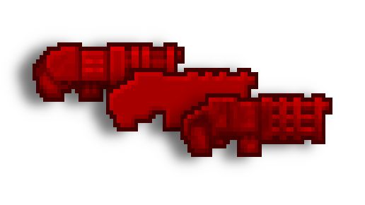
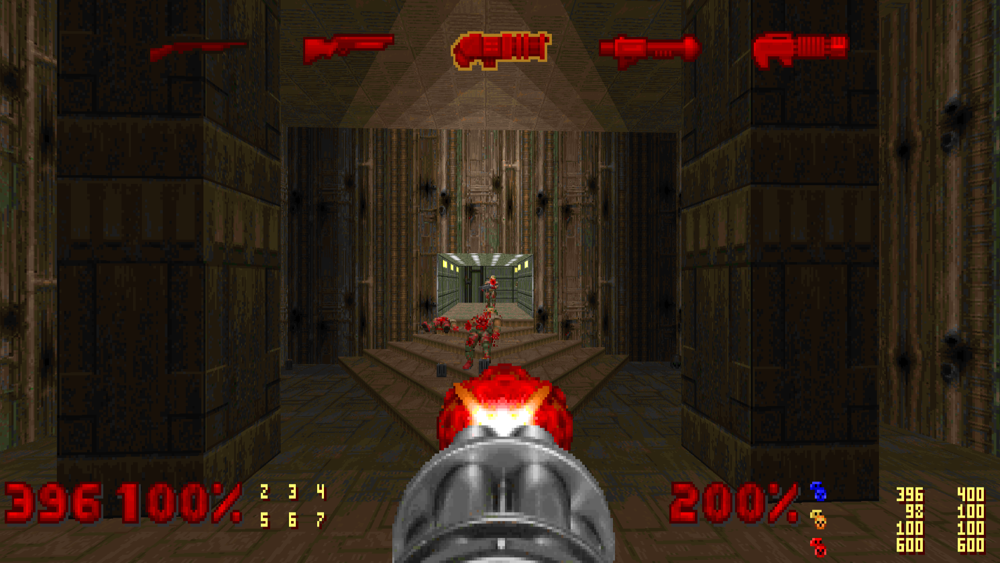
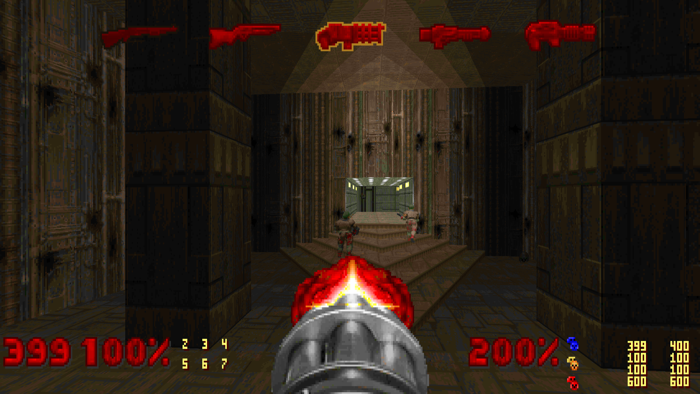
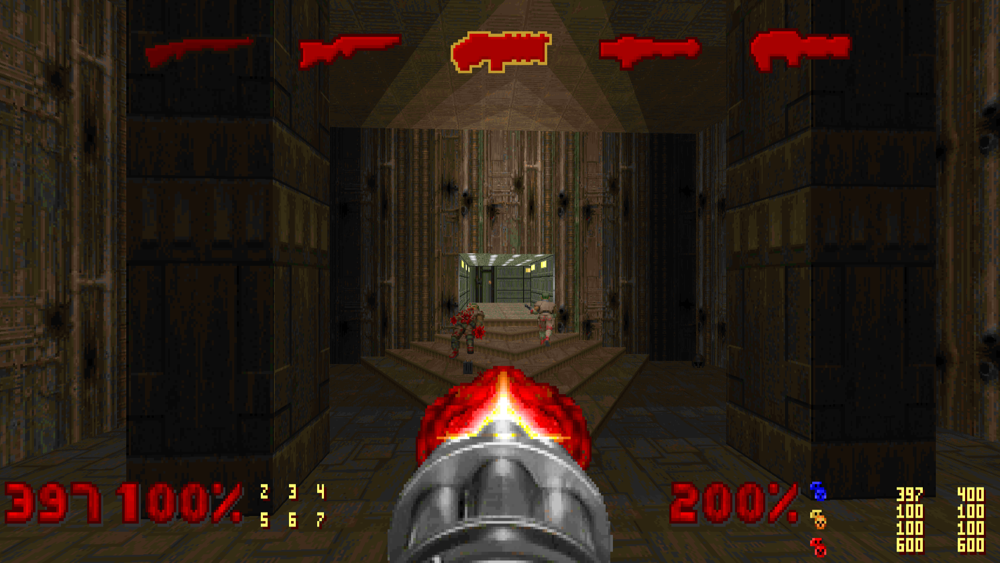

# Doom Carousel Icons

 

  

 

Originally introduced in the [Unity](https://doomwiki.org/wiki/Doom_Classic_Unity_port) port of Doom, later included in the [KEX](https://doomwiki.org/wiki/Doom_%2B_Doom_II) port, this featured highlights to the player what weapons are currently available.

Namely, after my favorite source port, [Woof!](https://github.com/fabiangreffrath/woof), had introduced support for the feature, I decided to start this project to give focus to, and highlight, this feature to the wider Classic Doom community.

Check the official Doomworld Forums [thread](https://www.doomworld.com/vb/thread/150923) for this project.

Credits to Julia Nechaevskaya for making the original set of Woof! carousel icons, of which almost all of these are based on.  
And thanks to my friend, Djoga, for pushing me forward to try and make my own edits, leading me down this road.  
In-depth attribution can be found in the Forum thread.  

## Screenshots

### Official Unity/KEX Icons [[Get it here](./icons_official.wad)]

### Default Woof! Icons [[Get it here](./icons_woof_base.wad)]

### Flat Woof! Icons [[Get it here](./icons_woof_flat.wad)]

